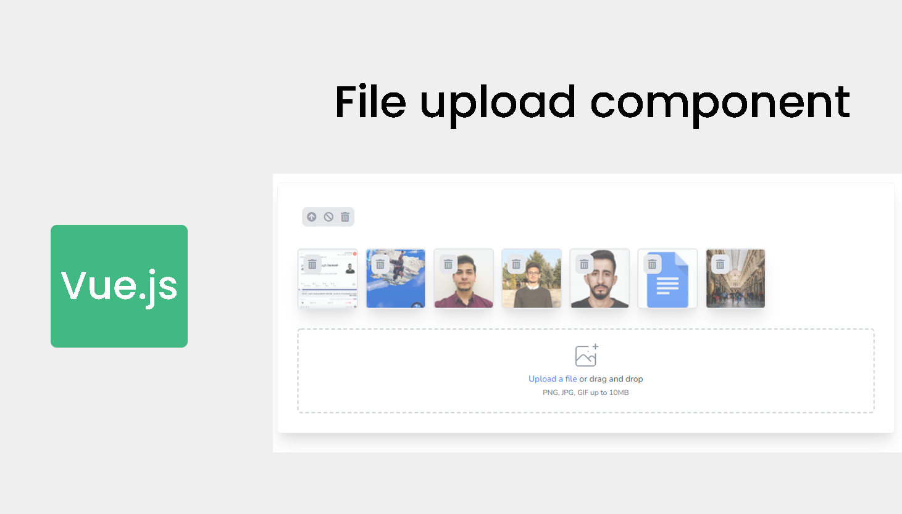

<h2 align="center">Supporting Upload file component</h2>

- [Become sponsor on Patreon](https://www.patreon.com/yazan_alnughnugh).
- [One-time donation via crypto-currencies](https://github.com/yazan-alnugnugh/laravel-datatable/blob/master/_docs/Donations/crypto/index.md).


# Introduction

<p align="center">
    
</p>

**are you looking for an easy way to upload files, this is what are you looking for.**

This is vue component for uploading files using ajax contain amazing features you can use it easily without any complexity

## Features
- Preview files before upload
- Multi-file upload
- Drag and Drop files
- Upload multiple files at the same time
- Delete/Delete all
- Cancel/Cancel all
- Chunk upload

## Demo

 [File Upload Demo](https://packages.tourismcaravan.com/uploads)
 
## Requirements

* [Tailwind](https://tailwindcss.com/) => 3.*
* [Axios](https://github.com/axios/axios) => 2.2.17*


## Installation
   
 
To install and setup the component we will follow a few steps:

#### step 1 
```bash
npm i @yazan.alnughnugh/file-upload
```
#### step 2 
```javascript
// app/resources/js/app.js

 Vue.component('file-upload', require('@yazan.alnughnugh/file-upload').default);
```


## Usage
   
   to start use our component we will add component to our blade file with two props
   ```url``` is the url where you want to send request to it 
   ```id``` if you want to send model id with request
   ```label``` here you can add your description
   
```html
// resources/posts/create.blade.php

  <file-upload :url="url" :id="id" :label="label"></file-upload>

```

#### Request
The request will send Like bellow
The files will send one By one , one request for each file

```php
// resources/posts/create.blade.php

  [
    "id" => "9", // if you added id
    "file" => File , // this is our file
  ] ;   

```

## Configuration


| Name | Type | Default | Description  
| --- | --- | --- | --- |
| `url ` | String | "/" | is the url where you want to send request to it  |
| `id` | Number | null |  if you want to send model id with request |
| `label` | String | 'PNG, JPG, GIF up to 10MB' | here you can add your description |
